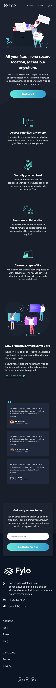

# Frontend Mentor - Fylo Dark Theme Landing Page Solution

This is a solution to the [Fylo Dark Theme Landing Page challenge on Frontend Mentor](https://www.frontendmentor.io/challenges/fylo-dark-theme-landing-page-5ca5f2d21e82137ec91a50fd). Frontend Mentor challenges help you improve your coding skills by building realistic projects. 

## The challenge

Users should be able to:

- View the optimal layout for the site depending on their device's screen size
- See hover states for all interactive elements on the page

## Screenshot

### Mobile



### Desktop


## Built with

- Semantic HTML5 markup
- CSS custom properties
- Flexbox
- CSS Grid
- Mobile-first workflow
- JavaScript

## What I learned

The main thing I learnt in this project was how to use Intersection Observers, to make the nav bar change appearance as you start to scroll down and to make elements fade in as you scroll down. Here is the JavaScript for both applications of Intersection Observers:

```js
// Change Header styles on scroll
const HEADER = document.querySelector('[data-header]');
const BOUNDARY = document.querySelector('[data-boundary]')

const headerChangeObserver = new IntersectionObserver(entries => {
    HEADER.classList.toggle('scrolled', !entries[0].isIntersecting);
}, { threshold: 1 });

headerChangeObserver.observe(BOUNDARY);

// Fade in selected elements on scroll
const FADE_IN_ELS = document.querySelectorAll('[data-fadeInOnScroll]');

const fadeInObserver = new IntersectionObserver(entries => {
    entries.forEach(entry => {
        if (!entry.isIntersecting) return;
        entry.target.classList.add('fade-in');
        fadeInObserver.unobserve(entry.target);
    });
}, { threshold: .5 });

FADE_IN_ELS.forEach(el => fadeInObserver.observe(el));
```

Also in this project I was a bit more experimental with the animations and I included a fake loading situation when submitting the form.

I read that `transform: translate3d` is more performant than `transform: translate` which I found surprising.

## Continued development

This was my first attempt at using Intersection Observers so I still don't feel as if I fully understand how they work. I am excited to experiment with it further as it can really make the page more interesting (though need to be careful not to overdo it).

### Useful resources

- [Landing Page Build (with Parallax) #8 - Fade Up Observers](https://www.youtube.com/watch?v=Fwa2UsXqqMM&list=PL4cUxeGkcC9iAkdBGipl-sd_x9JQKXwK9&index=8) - This tutorial made me want to try out the Intersection Oberserver.

